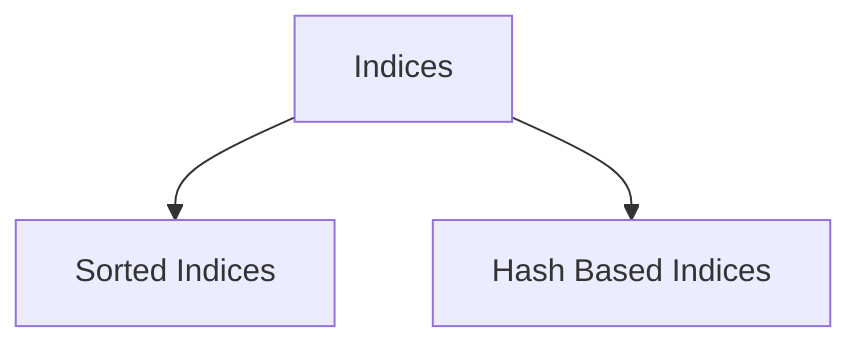

Database indexes may make or break your query. Learn about various kinds of
indexes in this post and when they are best suited.

Indexes can be broadly categorized in two categories - **sorted** and **hash**
based. Sorted are generally backed by tree based data structure and support range
queries (salary > 10,000) whereas hash indexes are like hash maps, best suited
for lookups (salary = 10,000).

## Ordered Indices

An Ordered Index stores values in sorted order like phone numbers in a directory
or index of a book. Each key in the index is associated with the tuple behind it.

Now it's possible that the keys are stored in an index in a sorted order, but the
actual tuple might not be present in sorted order. And that may cause an overhead
for reads. In these case, we can use a **Clustering Index**.

### Clustering Index

A clustering index makes sure to order the tuples on the disk in order of the keys.
This is generally present when we create an index on primary keys but not necessary
that only primary keys can have a clustering index.

### Non Clustering Index

Obviously, the opposite of above - indices whose search key specifies an order
different from what's stored on the disk. These are also called as seconday indices.

### Secondary Index

An index where keys are sorted but tuples on in files might not be sorted as the
keys are. Same as non-clustering index. This is true for all the 'other' indices
for a table because we can only order the tuples one way.

### Dense Index and Sparse Index